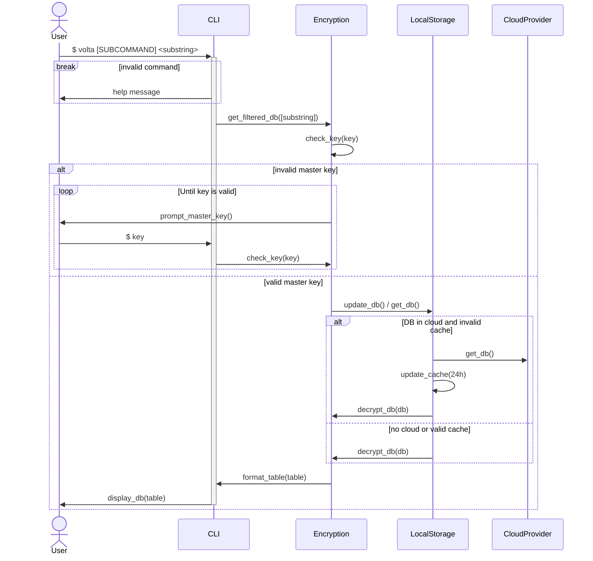

# Volta 🔐

> Password vault

## About

Password Vault 🔐 built with Rust that runs in the terminal.

## Features

API consists of CRUD operations on password:

- Create login and random password for a given domain
- Create login and given password for a given domain
- Read (copy to clipboard) password for a given domain
- List all domains
- Fuzzy search domains
- Update password of an existing domain
- Delete domain entry with its login and password
- Manage **Volta** configuration

DB (suggested) [unqlite](https://docs.rs/unqlite/latest/unqlite/).
It is based on the official [UnQLite](https://unqlite.org/index.html).
Some of the advantages are:

- A complete database with multiple collections, is contained in a single disk file.
- The database file format is cross-platform, you can freely copy a database between 32-bit and 64-bit systems or between big-endian and little-endian architectures.

Encryption:

- The database is stored **always** encrypted

## Libraries

This project is only possible due to the great effort of those libraries:

- [clap](https://lib.rs/crates/clap)
- [clipboard](https://lib.rs/crates/clipboard)
- [jwt](https://lib.rs/crates/jwt)
- [owo-colors](https://lib.rs/crates/owo-colors)
- [serde](https://lib.rs/crates/serde)
- [slug](https://lib.rs/crates/slug)
- [tabled](https://lib.rs/crates/tabled)
- [unqlite](https://lib.rs/crates/unqlite)

## Features of `v1.0.0`

Basic functionality:

- [x] This app allows to manage a password database in the terminal (create, read, update and delete)
- [x] An entry (main model of storage) is composed of `domain`, `user` and `pass`
- [x] Search should be enabled with a domain substring
- [x] When search returns only one result the password is copied to the clipboard
- [ ] The passwords are always stored encrypted

:gear: Configuration:

- [ ] By default **Volta🔐** is installed under `/usr/local/bin`
- [ ] Unique **config:gear:** file under `~/.config/volta/config.yml`
- [ ] When using a library that allows for style configuration, this shold be available through the **config:gear:**
- [ ] When first launching the app the user is prompted to fill some configuration fields

Storage:

- [x] By default the db is a key-value file based database (i.e. [unqlite](https://unqlite.org/)), allowing for a fast read and easily encryption of the hole db
- [ ] It is stored besides the configuration file `.config/volta/<db_name>.db`
- [ ] Using a factory pattern it should be easy to create different providers for cloud storage of the encrypted file
- [ ] The cloud provider choice is done on the configuration file

Encryption:

- [ ] In the first launch of the application a **master password:key:** should be created to create the encrypt/decrypt the database
- [ ] Anyone with the **master password:key:** should be able to read the db contents, allowing to share the database through a cloud provider, if desired
- [ ] If the **master password:key:** is lost there is no way to recover the db contents
- [ ] When launching the application the user is prompted to enter the **master password:key:**, which is valid for the next 15 minutes

## Architecture

After initial configuration step this is the sequence diagram executed each time the program is invocated:

## Installation

## Configuration

All configuration is done through `./config.yml`.

## Usage

CRUD operations:

- `volta`: List all passwords ordered alphabetically by domain
- `volta <partial_domain> [<partial_user>]`: Filter password list filtered by `parial_domain`, then by `partial_user` if passed.
    Whenever there is only one output, the password is copied to the clipboard
- `volta add -d | --domain <domain> -u | --user <user>`: Adds to the db an entry for `domain` and `user` with a random generated `password`
- `volta add -d | --domain <domain> -u | --user <user> -p | --pass <password>`: Adds (or replaces) to the db an entry for `domain`, `user` and `password`
- `volta rm -d | --domain <domain> -u | --user <user>`: Delete password from `user` in `domain`

Extra:

- `volta -h | --help`: Displays help information
- `volta -c | --config`: Displays all configuration information by `key`: `value`
- `volta -c | --config <key> <value>`: Changes default configurations for `key` with `value`

## Known Issues

- No support for Windows
- No support for Linux

## Contribute

Approaching `v1` any suggestion is well received through an issue.
